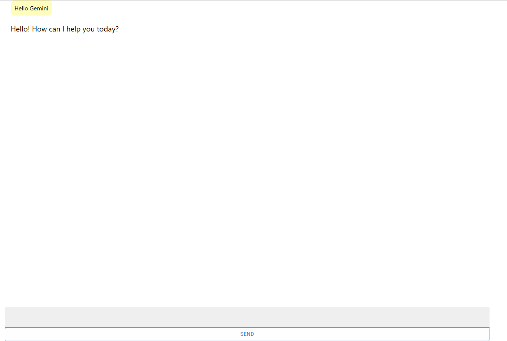

# Aichat

Aichat is a web application that allows you to chat with Google's Gemini LLM. With Aichat, you can type any text and receive real-time responses from Gemini, featuring a streaming interface for a smooth and interactive experience.



## Features

- **Chat with Gemini LLM**: Send any message and get responses from Google's language model.  
- **Streaming Responses**: Watch responses appear in real-time as they are generated.  
- **Simple and Intuitive UI**: Focus on chatting without distractions.  
- **Docker Support**: Run Aichat easily with Docker.  

## Getting Started

### Prerequisites

- Node.js (v18+ recommended)  
- NPM or Yarn  
- Google Gemini API key  
- Docker (optional, if you want to run via container)  

## Docker Usage

You can run Aichat using Docker without installing Node.js:

```bash
# Build the Docker image
docker build --no-cache -t aichat .

# Run the Docker container
docker run -d -p 3000:80 --name aichat_container aichat

# Open your browser at http://localhost:3000

# Stop the container
docker stop aichat_container

# Remove the container
docker rm aichat_container